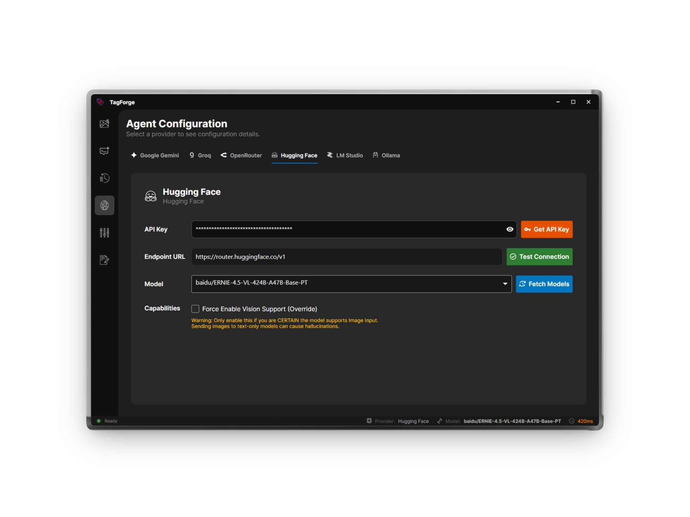
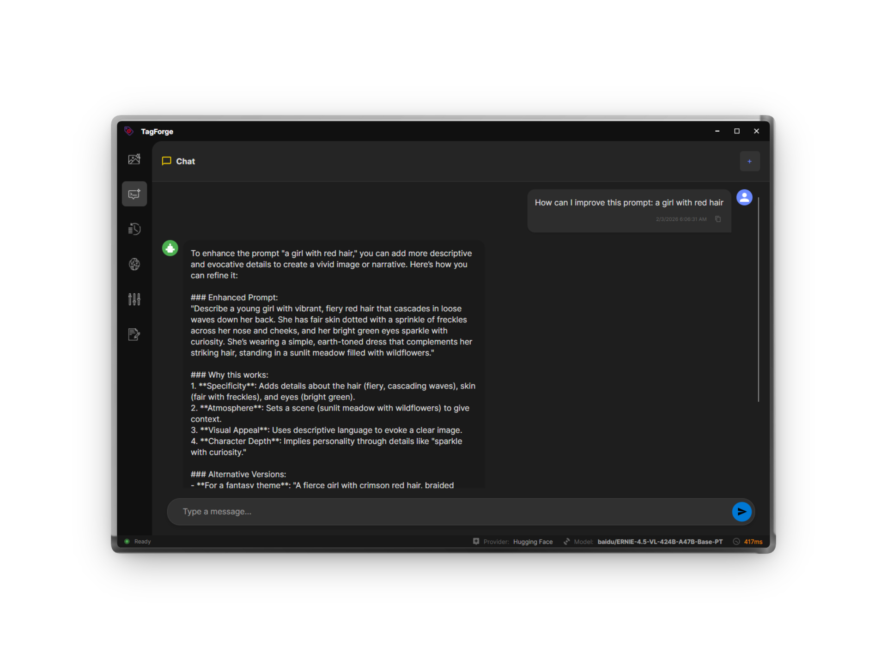
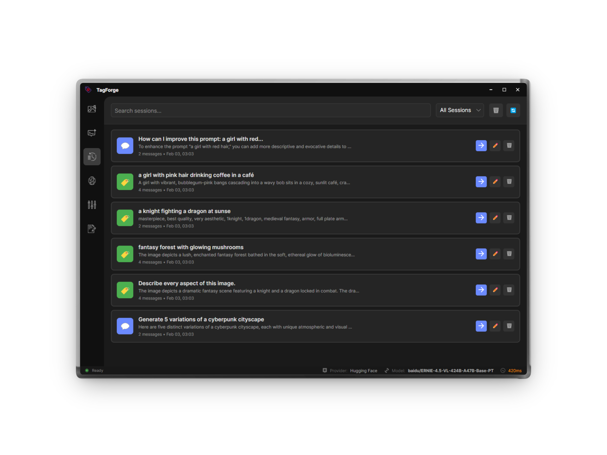
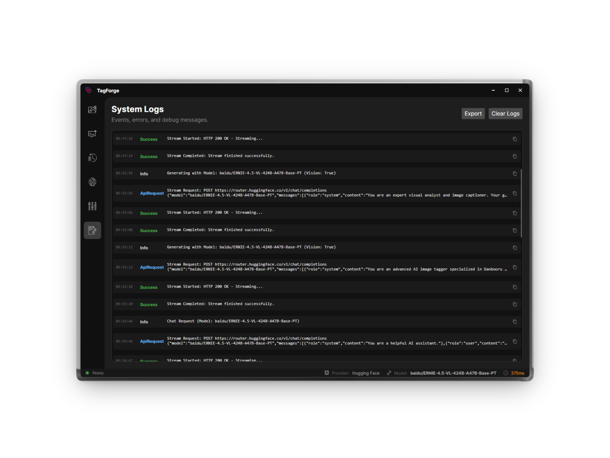
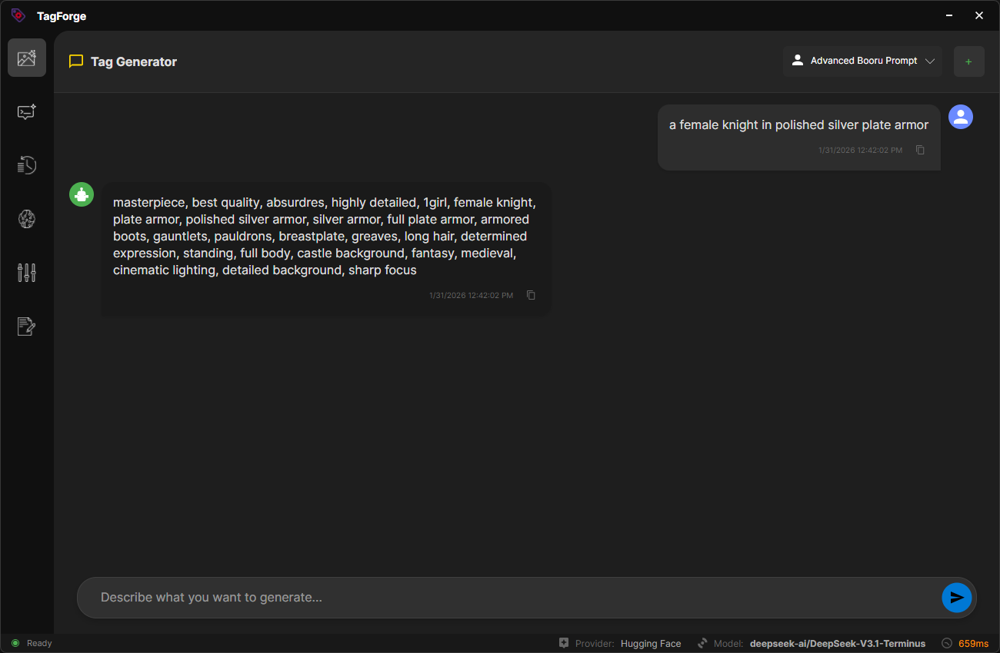

# 🏷️ TagForge


> **Advanced AI tagging and prompt generation studio.**  
> Leverage the power of modern LLMs to craft perfect Stable Diffusion prompts in a sleek, high-performance desktop app.

---

## 📸 Screenshots

<div align="center">
<table width="100%">
  <tr>
    <td width="33%" align="center">
      
    </td>
    <td width="33%" align="center">
      
    </td>
    <td width="33%" align="center">
      
    </td>
  </tr>
  <tr>
    <td align="center">Agents</td>
    <td align="center">Chat</td>
    <td align="center">History</td>
  </tr>
  <tr>
    <td width="33%" align="center">
      
    </td>
    <td width="33%" align="center">
      
    </td>
    <td width="33%" align="center">
      
    </td>
  </tr>
  <tr>
    <td align="center">Logs</td>
    <td align="center">Settings</td>
    <td align="center">TagGenerator</td>
  </tr>
</table>
</div>

---

## ✨ Key Features

TagForge provides a unified interface for your AI operations:

-   **🎨 Tag Generator**: A specialized mode designed to convert simple ideas into massive, detailed, comma-separated tag lists optimized for Stable Diffusion and other image generators.
-   **🔒 Secure Configuration**: Your API keys are encrypted at rest using Windows DPAPI—they never leave your machine except to contact the provider.
-   **⚡ High Performance**: Built on .NET 9 with native background threading, ensuring the UI remains silky smooth even during heavy generation tasks.
-   **🌍 Localization**: Fully localized interface available in **English**, **French**, and **Spanish**.
-   **📂 History Management**: Automatically saves your generation history and chat sessions locally.

---

## 🎭 Personas

TagForge includes a powerful Persona system that lets you define custom behaviors for the AI:

-   **🖊️ Custom System Prompts**: Define exactly how the AI should act (e.g., *"You are a Python expert"* or *"You are a creative writer"*).
-   **🔄 Dynamic Interpolation**: Use `{input}` in your system prompt to wrap the user's message in a template.
    *   *Example*: `Convert the following description into comma-separated tags: {input}`
-   **⚙️ Default Modes**: Includes pre-configured profiles for **SFW** and **NSFW** Danbooru tag generation to get you started immediately.

---

## 🌟 Supported Providers

TagForge currently supports the following AI providers:

-   **✨ Google Gemini**: Fast and reliable multimodal models.
-   **🚀 Groq**: Ultra-low latency inference for Llama/Mixtral models.
-   **🔗 OpenRouter**: Access to top models from OpenAI, Anthropic, and more via a unified API.
-   **🤖 LM Studio**: Connect to your local LM Studio server for private inference.
-   **🦙 Ollama**: Local, private execution (runs on your machine).
-   **🤗 Hugging Face**: Access thousands of open-source models via the Router API.

---

## 🌍 Localization

TagForge is available in **English**, **French**, and **Spanish**.

**Want to add your language?**  
It's easy! Check out the [**Translation Guide**](TRANSLATION_GUIDE.md) to learn how to contribute a new language in minutes. All contributors will be credited!

---

## 🛠️ Build & Installation

TagForge is built on **.NET 9.0** and **Avalonia UI** for cross-platform performance.

### Prerequisites
-   [.NET 9.0 SDK](https://dotnet.microsoft.com/download)

### How to Build (Single-File)
To produce a clean, standalone executable:

```bash
dotnet publish -c Release -r win-x64 -p:PublishSingleFile=true --self-contained true -o ./publish
```

This generates `TagForge.exe` in the `./publish` folder with all dependencies embedded.

---

## 💖 Credits

TagForge uses icons and assets from the following amazing sources:

-   **LLM Model Icons**: [LobeHub](https://lobehub.com/)
-   **UI Icons**: [The Noun Project](https://thenounproject.com/)

---

## 📈 Visitors

<p align="center">
  
</p>
