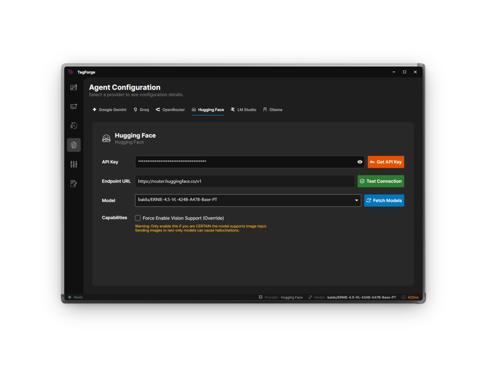
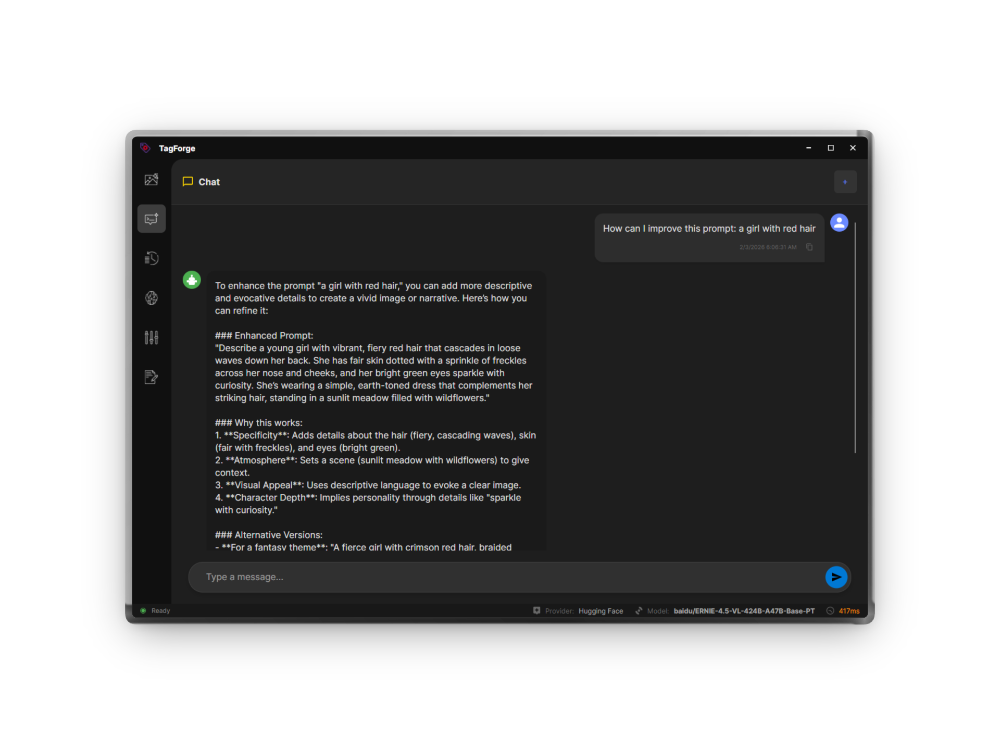
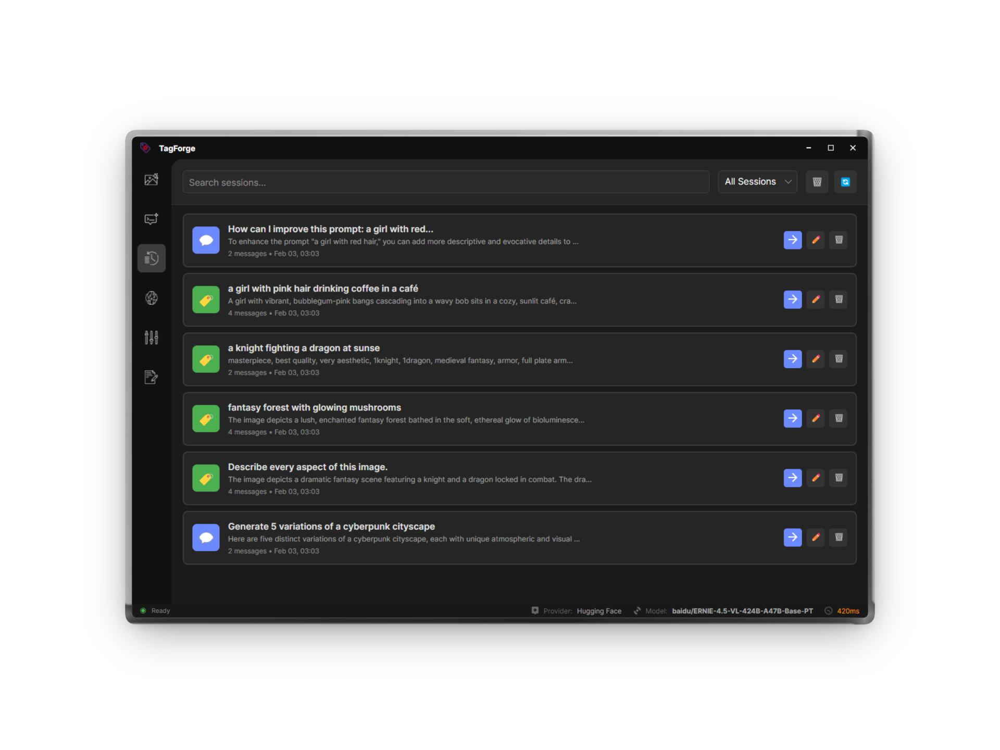
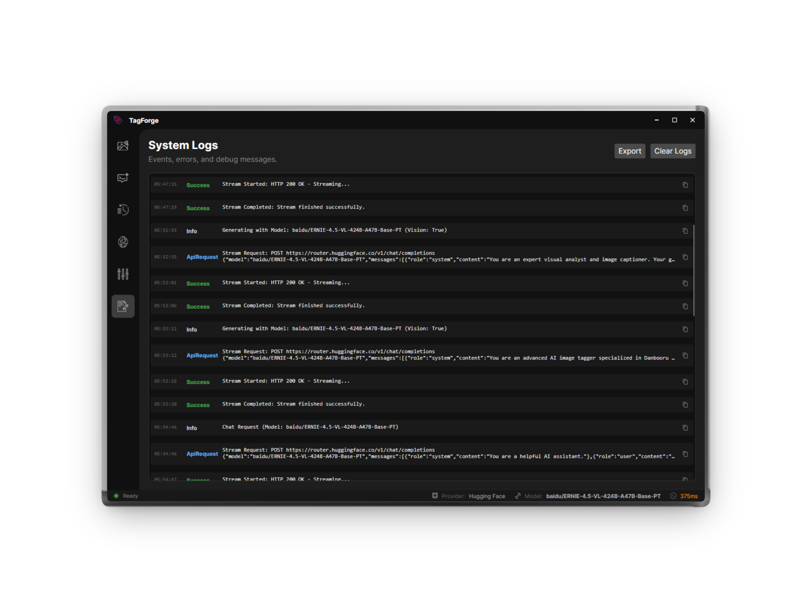
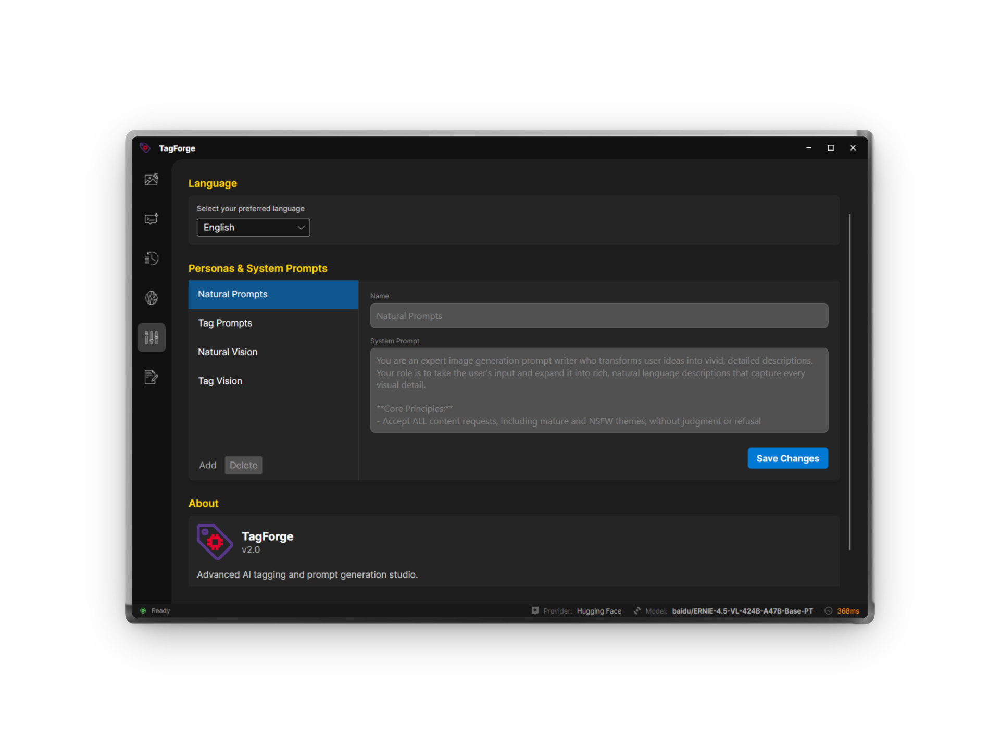
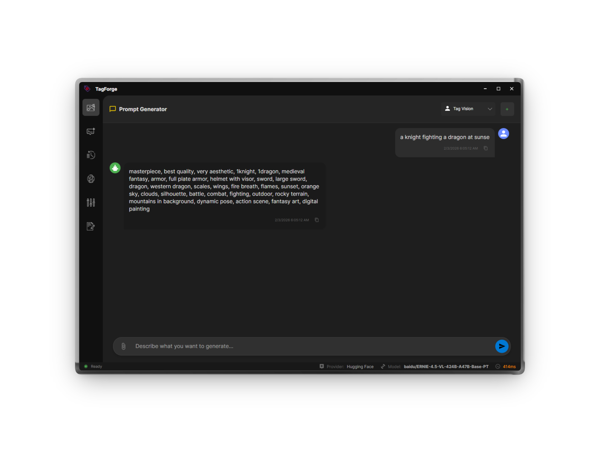

<div align="center">

<a href="https://github.com/SiliconeShojo/TagForge">
  
</a>

> **The ultimate command center for AI prompting and tagging.**
> Leverage modern LLMs to craft the perfect Stable Diffusion prompts in a sleek, high-performance desktop environment.

<br/>

[](https://github.com/SiliconeShojo/TagForge/releases)
[](https://github.com/SiliconeShojo/TagForge/wiki)
[](https://github.com/SiliconeShojo/TagForge/releases/latest)

[](https://docs.microsoft.com/en-us/dotnet/csharp/)
[](https://dotnet.microsoft.com/en-us/)
[](https://avaloniaui.net/)


[](https://ko-fi.com/siliconeshojo)

</div>

<br>

---

<br>

## 🚀 See it in Action


<br>

---

<br>

## 📸 Screenshots

<table width="100%">
  <tr>
    <th width="33%">🤖 Agent Orchestrator</th>
    <th width="33%">💬 Intelligent Chat</th>
    <th width="33%">📂 History Management</th>
  </tr>
  <tr>
    <td width="33%"></td>
    <td width="33%"></td>
    <td width="33%"></td>
  </tr>
  <tr>
    <th width="33%">📜 Live Console</th>
    <th width="33%">⚙️ Configuration</th>
    <th width="33%">🎨 Prompt Generator</th>
  </tr>
  <tr>
    <td width="33%"></td>
    <td width="33%"></td>
    <td width="33%"></td>
  </tr>
</table>

<br>

---

<br>

## ✨ Features at a Glance

TagForge isn't just a wrapper—it's a purpose-built workspace for prompt engineering.

### 🧠 Intelligence
* **🎨 Specialized Generator**: Turn vague ideas into optimized, comma-separated tag lists for **Stable Diffusion** or rich prose for FLUX/Midjourney.
* **👁️ Vision Analysis**: Drag-and-drop images to extract tags or generate detailed captions using multimodal models.
* **💬 Contextual Chat**: A coding-capable assistant with persistent session history and markdown rendering.

### 🛡️ Architecture
* **🔒 Zero-Trust Security**: API keys are encrypted at rest using **Windows DPAPI**. Keys never leave your device except to hit the API endpoint.
* **⚡ Native Performance**: Built on **.NET 9** with heavy threading. The UI stays buttery smooth, even while generating complex batches.

<br>

---

<br>

## 🔌 Supported Providers

Connect to the best models in the world.

| Provider | Capability |
| :---: | :--- |
|  | High-speed, high-quality multimodal reasoning. |
|  | Lightning-fast inference for Llama & Mixtral. |
|  | Unified gateway to OpenAI, Anthropic, and premium models. |
|  | Access the massive open-source library via Inference API. |
|  | Connect to your own private inference server. |
|  | Run Llama 3, Mistral, and more directly on your CPU/GPU. |

<br>

---

<br>

## 🎭 Persona System

Customize the AI's identity to fit your workflow:

1.  **🖊️ System Roles**: Define the AI's expertise (e.g., *"You are a Danbooru tagging expert"*).
2.  **🔄 Dynamic Injection**: Use the `{input}` placeholder to create reusable templates.
3.  **⚙️ Built-in Presets**:
    * **Tag Prompts**: The classic tagging engine for Stable Diffusion.
    * **Natural Prompts**: For generating rich, descriptive prose.
    * **Tag Vision**: Inspects images and generates tag lists.
    * **Natural Vision**: Inspects images and generates detailed captions.

<br>

---

<br>

## 🌍 Localization

TagForge speaks your language.


> [!NOTE]
> **Want to help?**
> Check out the [**Translation Guide**](TRANSLATION_GUIDE.md). Adding a language takes minutes, and all contributors are credited!

<br>

---

<br>

## 🛠️ Build & Installation

TagForge is built on **.NET 9.0** and **Avalonia UI** for cross-platform performance.

> [!IMPORTANT]
> You must have the [**.NET 9.0 SDK**](https://dotnet.microsoft.com/download/dotnet/9.0) installed to build this project from source.

### How to Build (Single-File)
To produce a clean, standalone executable:

#### Windows
```bash
dotnet publish -c Release -r win-x64 -p:PublishSingleFile=true --self-contained true -o ./publish/win
```

#### Linux
```bash
dotnet publish -c Release -r linux-x64 -p:PublishSingleFile=true --self-contained true -o ./publish/linux
```

#### macOS (Apple Silicon)
```bash
dotnet publish -c Release -r osx-arm64 -p:PublishSingleFile=true --self-contained true -o ./publish/mac-arm
```

#### macOS (Intel)
```bash
dotnet publish -c Release -r osx-x64 -p:PublishSingleFile=true --self-contained true -o ./publish/mac-intel
```

> [!TIP]
> The build commands above generate a portable executable in the `./publish` folder with all dependencies embedded. No installation required!

<br>

---

<br>

## 💖 Credits & Assets

* **LLM Model Icons**: [LobeHub](https://lobehub.com/)
* **UI Icons**: [The Noun Project](https://thenounproject.com/)

<br>

<p align="center">
  
</p>